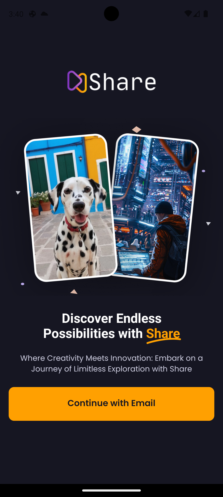
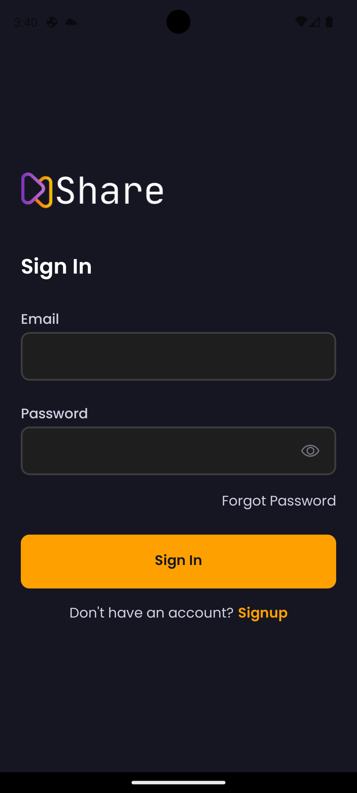
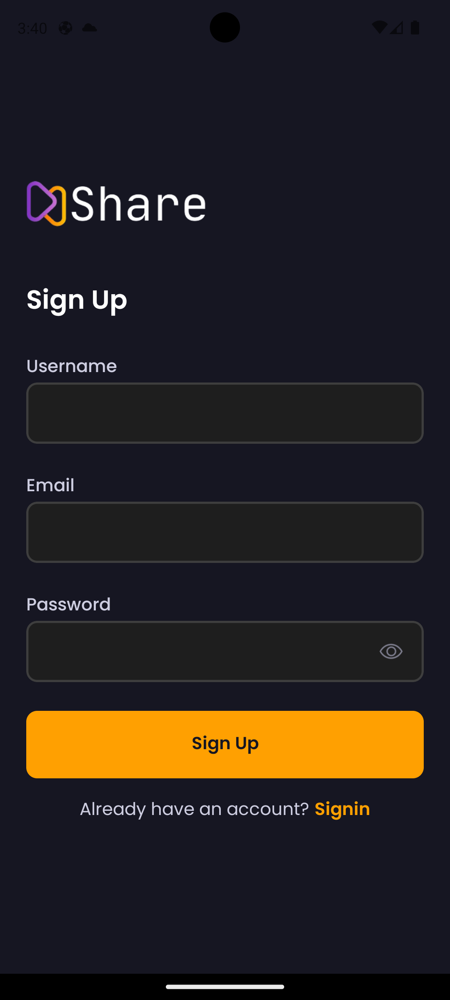
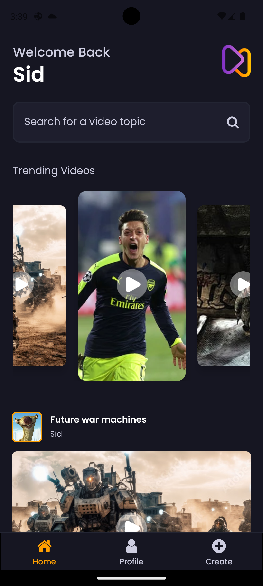
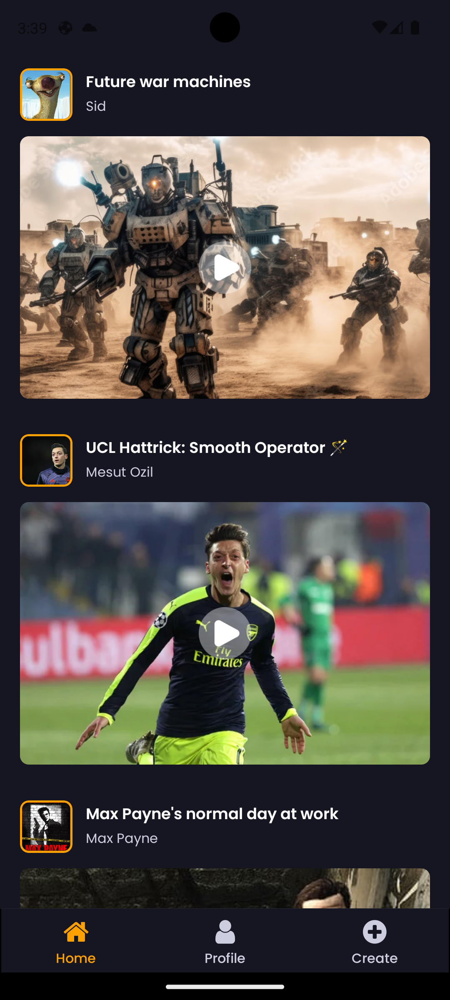
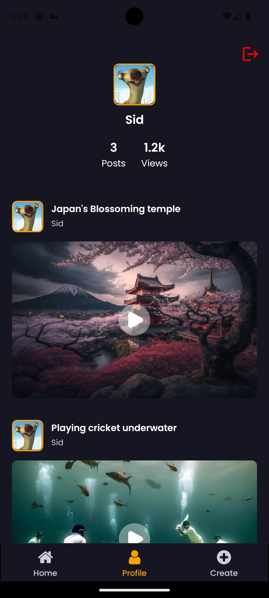
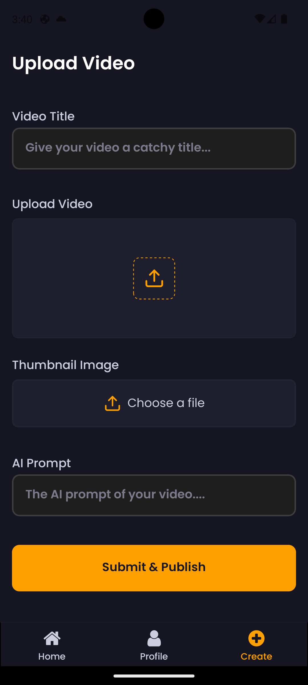
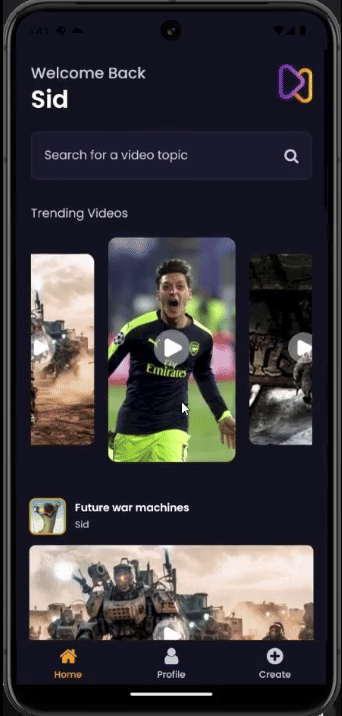
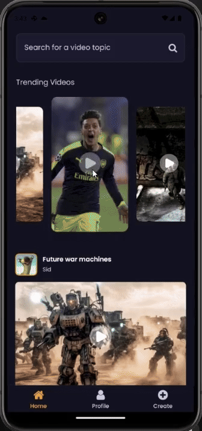

# Share

## 📋 <a name="table">Table of Contents</a>

1. 🤖 [Introduction](#introduction)
2. 🖼️ [Screenshots](#screenshots)
3. ⚙️ [Tech Stack](#tech-stack)
4. 🔋 [Features](#features)
5. 🤸 [Quick Start](#quick-start)

## <a name="introduction">🤖 Introduction</a>

Welcome to **Share**, a revolutionary mobile application that empowers you to share videos directly from your device with the world. Built using the power of React Native for a seamless cross-platform experience and leveraging Appwrite as a robust cloud backend, VideoShare is designed to make video sharing effortless and enjoyable.

Join the community of video enthusiasts and start sharing your moments with VideoShare! 🚀

```
This is still a work in progress
If you find any bugs you can report it to me.
Pull requests are always welcome. For major changes, 
please open an issue first to discuss what you would like to change.

```

## <a name="screenshots">🖼️ Screenshots</a>
<div style="display: flex; flex-direction: 'row';">
 
 
  
 
 
 
 
 
 
</div>

## <a name="tech-stack">⚙️ Tech Stack</a>

- React Native
- Expo
- Stylesheet
- Animatable
- Appwrite

## <a name="features">🔋 Features</a>

👉 **Onboarding Screen**: Engaging graphics and clear instructions welcome users to the app.

👉 **Robust Authentication & Authorization System**: Secure email login safeguards user accounts.

👉 **Dynamic Home Screen with Animated Flat List**: Smoothly animated flat list showcases the latest videos for seamless browsing.

👉 **Pull-to-Refresh Functionality**: Users can refresh content with a simple pull gesture for up-to-date information.

👉 **Full-Text Search Capability**: Efficiently search through videos with real-time suggestions and instant results.

👉 **Nested Navigation**: Tab & Native-Stack Navigation, Navigate between sections like Home, Search, and Profile with ease using tab navigation.

👉 **Post Creation Screen for Uploading Media**: Upload video and image posts directly from the app with integrated media selection.

👉 **Profile Screen with Detailed Insights**: View account details and activity, including uploaded videos and follower count, for a personalized experience.

👉 **Responsiveness**: Smooth performance and adaptability across various devices and screen sizes for a consistent user experience.

👉 **Cross-Platform**: Enjoy a consistent experience on both iOS and Android devices.

👉 **Cloud Backend:**: Powered by Appwrite, ensuring secure and scalable storage and management of your videos and auth.

and many more, including code architecture and reusability 

## <a name="quick-start">🤸 Quick Start</a>

Follow these steps to set up the project locally on your machine.

**Prerequisites**

Make sure you have the following installed on your machine:

- [Git](https://git-scm.com/)
- [Node.js](https://nodejs.org/en)
- [npm](https://www.npmjs.com/) (Node Package Manager)

**Cloning the Repository**

```bash
git clone https://github.com/SiddharthSsb11/rn-share.git
cd rn-share
```
**Installation**

Install the project dependencies using npm:

```bash
npm install
```

**Running the Project**

```bash
npm start
```

**Expo Go**

Download the [Expo Go](https://expo.dev/go) app onto your device, then use it to scan the QR code from Terminal and run.